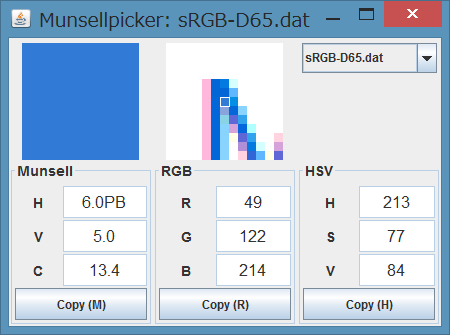

# Munsellpicker
Musellpicker captures a color under your mouse pointer on the screen and views its Munsell Color code, RGB, and HSV. It runs in most environments (Windows, Mac OS, Linux etc.) as it is built on Java.



## Binaries
You can get the binary of the latest release on the [release page](https://github.com/privet-kitty/Munsellpicker/releases).

## Usage
If you already have JRE (Java Runtime Environment) in your system, you can run it just by double-clicking `Munsellpicker.jar` or executing in your console:

```
javaw -jar Munsellpicker.jar
```
If you use windows, it will be better to run `Munsellpicker-windows.exe` instead.

If you don't have JRE, you can find it on [java.com](https://java.com/download/). JRE 8 (Ver. 1.8) is recommended.

You can choose sRGB or AdobeRGB (D65) conforming to the setting of your monitor. (If you need other RGB spaces, just make an [issue](https://github.com/privet-kitty/Munsellpicker/issues).)

## Conversion method
Munsellpicker uses [munsell-inversion-data](https://github.com/privet-kitty/munsell-inversion-data) as the inversion data of Munsell Color, which ultimately originates from the [Munsell renotation data](https://www.rit.edu/cos/colorscience/rc_munsell_renotation.php). See the links for more details.

## Copyright
Copyright (c) 2018 Hugo I.
